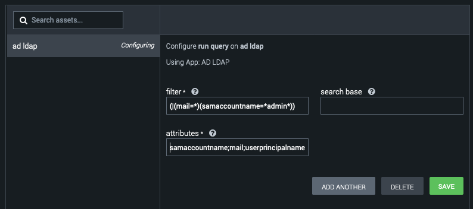
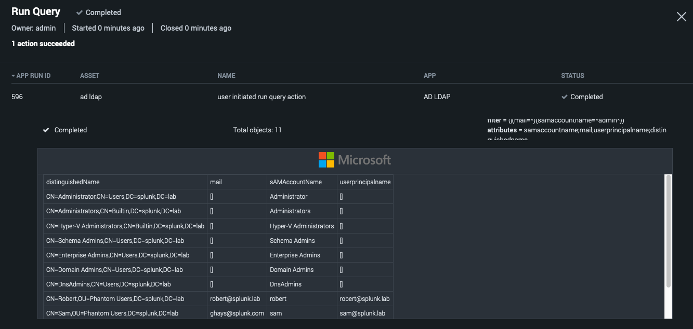
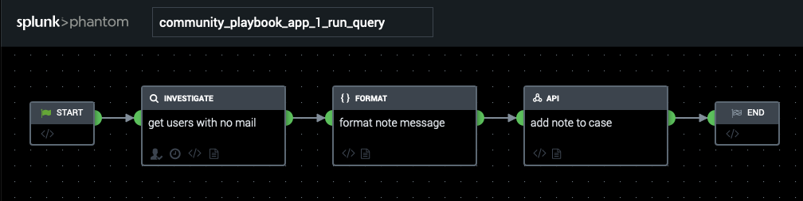
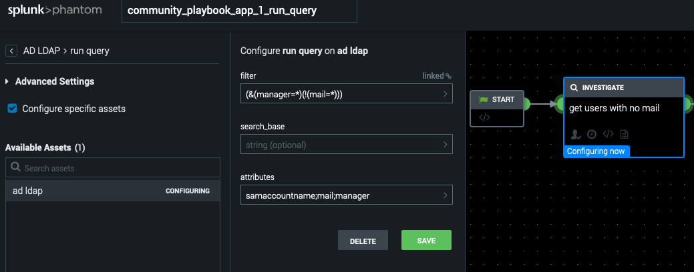
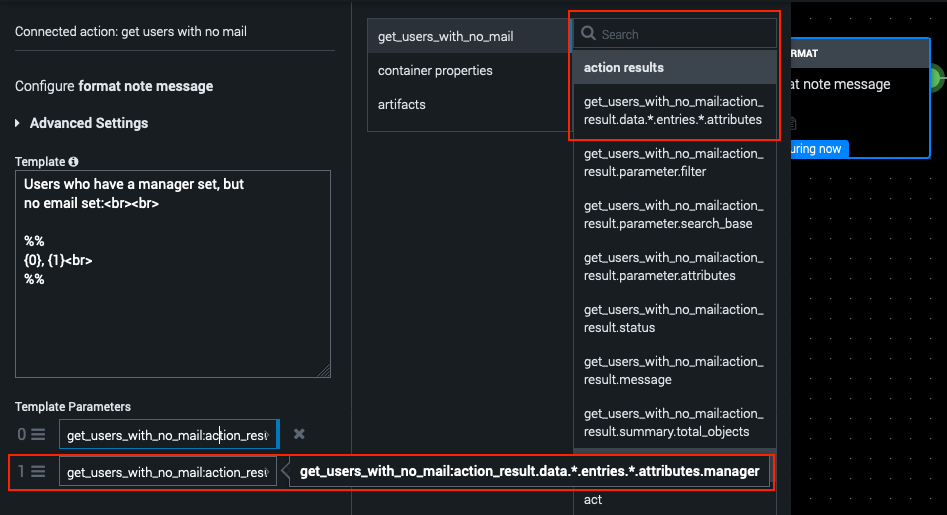
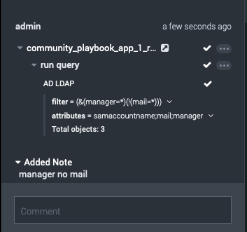
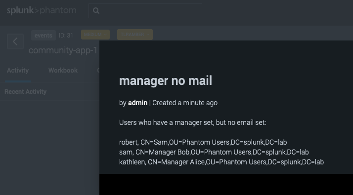

# AD LDAP
## Community App Project #1

First:  
My thanks to everyone who is actively contributing to the Phantom community. Doubly-so for those of you working on Apps in our GitHub repo and in our Slack channel.

Second:  
This app serves a few purposes. The primary is that I wanted additional features available for LDAP. The second is that I thought some of the hackers in the community might want to dig into a project "owned" by us - and finally, for folks just developing their dev chops, a place to learn and grow.

Third:  
This page is intended to serve as a _living_ document for this app with plently of use-cases, examples, and technical information. Please feel free to contribute!

## The Documentation
- [App Information](#app-information)
- [App Configuration](#app-configuration)
- [Actions](#actions)
    - [Run Query](#run-query)
    - [Add group member](#add-group-member)
    - [Remove group member](#remove-group-member)
    - [Get Attribute](#get-attribute)
    - [Set Attribute](#set-attribute)
    - [Disable Account](#disable-account)
    - [Enable Account](#enable-account)
    - [Unlock Account](#unlock-account)
    - [Reset Password](#reset-password)
    - [Move Object](#move-object)

## App Information
This LDAP application utilizes the [LDAP3](https://ldap3.readthedocs.io/) library for Python. This was chosen, in part, due to the pythonic design of the library and the quality of the documentation.

The AD LDAP app only supports [Simple Binding](https://ldap3.readthedocs.io/bind.html#simple-bind) at this time but other methods (e.g. NTLM) could be added relatively easily. It should be noted that [SSL](https://ldap3.readthedocs.io/ssltls.html) is suppoted and enabled by default, but [TLS](https://ldap3.readthedocs.io/ssltls.html#the-tls-object) (start_tls) has not due to certificate complexity within the configuration page.

If someone in the community requests either of these (or adds them with pull-request), I/we will try and make it happen. However, if neither of those happen - I'll implement NTLM soon, but probably not TLS.

### App Configuration
The configuration for this app is relatively straightforward. Let's looks at each component:

First, you'll need an account with which to Bind and perform actions. If you are only ever going to perform *information gathering* tasks (e.g., getting account attributes) then a standard user account would be fine. However, if you plan on doing things like Unlocking, Resetting Passwords, Moving objects, etc. - then you will need an account with permissions to actually perform these actions.  I would caution you to NOT use a "Domain Administrator" (or higher) account. Instead, delegate the appropriate least-privilege access to a service account with a very strong password... In other words, harden the account.
Obviously this can require more thorough testing than just giving the account Domain Admin privs... but thats why you make the big bucks. :)

Second: If you find yourself NOT using SSL, then you should take a good, hard look at why you're doing that. If you don't use SSL then someone could observe the password crossing over the wire. This is bad. Instead: fix SSL. If you have other binding requirements (other than Basic), raise an Issue on the project, maybe we can get it implemented.

(As an aside: My recommendation as a security professional is to disallow insecure (plaintext AND unsigned binds) if at all possible ([ref](#references): 1, 2, 3))

## Actions
### Run Query
One of the things I had been missing from the original Phantom LDAP application was a _generic_ query command. This app has implemented such functionality which will be demonstrated presently.

*Note: This command is useful for those who are familiar with LDAP syntax.*

Imagine you've run the following query:  
`(|(mail=*)(samaccountname=*admin*))`

The effectively says: "If the mail attribute is present or samaccountname matches '\*admin\*', return results. Also in the screenshot above, I have omitted the searchbase which, in this app, means the root dn will be found and used (see `_get_root_dn()` for implementation details). Finally, we name the following attributes to be gathered:  

`samaccountname;mail;userprincipalname;distinguishedname` (Note: semi-colon separated)

In my lab, I got the following results:

Note that the UI has a custom renderer to show all the attributes requested. 

#### Important Notes for 'Run Query':
Because the Phantom architecture requires the resulting values in the data path to be coded during app-development, the attributes dynamically requested cannot be defined in the json file. Consequently, they are not available when using the VPE. Instead, you must plug in the attribute by name. For an arbitrary example, imagine you have a playbook that periodically runs looking for users who *do* have a `manager` assigned but do *not* have a `mail` attribute assign. We might set up a playbook like this:

We might set our LDAP params like the following. Note that the query I'm using in this example is: `(&(manager=*)(!(mail=*)))`. This can be thought of as:
- AND
    - manager must exist
    - NOT
        - mail must exist

Or more plainly: "manager attribute must be populated and the mail attribute must not."

Now we can format the response in preperation for adding a note.

In the above screenshot, you see that there is a datapath available for selection called `get_users_with_no_mail:action_result.data.*.entries.*.attributes` (circled in red). However, the attributes we selected in the LDAP Query block (samaccountname;mail;manager) are not see in the UI. Therefore, you must type the attribute name in as I have done in the second, bottom circled section (where I've added ".manager").  Interestingly, Active Directory returns those with Microsoft's internal mixed-case formatting - like samaccountname = sAMAccountName. This is difficult to remember when trying to select a field, so to reduce the friction with that, the App automatically lower-cases all attribute names.

Finally, we just call the API action to add a note using the output of our format block and run the playbook. (NOTE: For the astute amongst you that noticed an inconsistency between screenshots - I removed the `mail` attribute for this demo... So, the screenshots aren't lying, the truth changed.)

And we can see the users were found and added to a note.

.

Of course, the output of `run query` could easily be used as input to many other AD LDAP actions or actions of other Apps.

# References
1. https://blogs.technet.microsoft.com/russellt/2016/01/13/identifying-clear-text-ldap-binds-to-your-dcs/
2. https://blogs.technet.microsoft.com/askds/2008/04/02/directory-services-debug-logging-primer/
3. https://docs.microsoft.com/en-us/windows/security/threat-protection/security-policy-settings/domain-controller-ldap-server-signing-requirements
