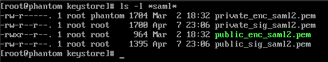
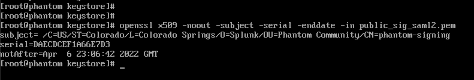

# How do I check SAML signing and encryption cert expiry?

The Phantom SAML keys are stored in `/opt/phantom/keystore`. You can view the SAML certs by issuing `ls -l *saml*`. 

To get information about them, you can use the `openssl` utility. To get the primary data you might need you can issue the command: `openssl x509 -noout -subject -serial -enddate -in public_sig_saml2.pem`. This will show you the Subject, Serial Number, and NotAfter (expiry) attributes of the certificate.

