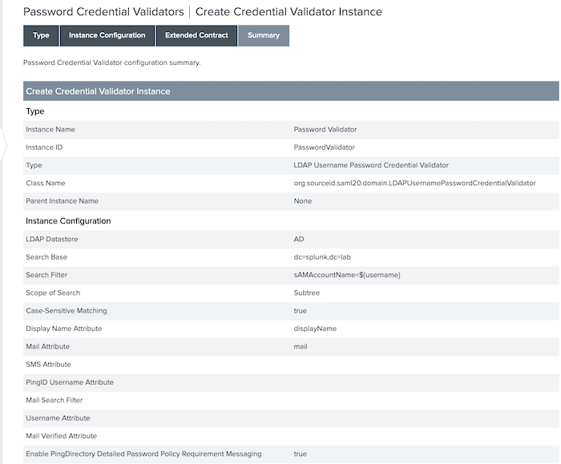
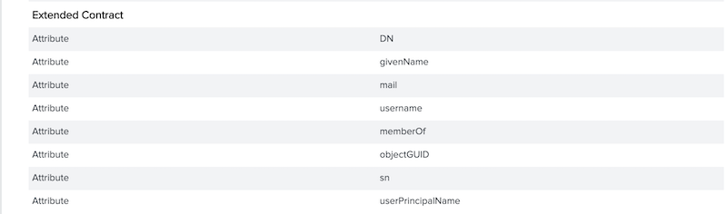
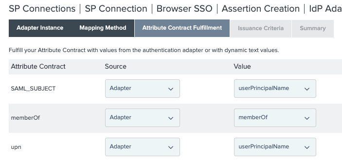
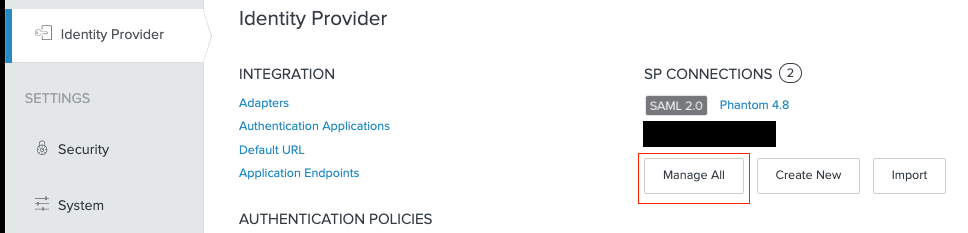
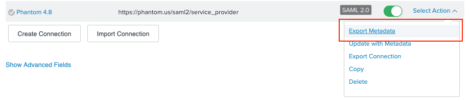
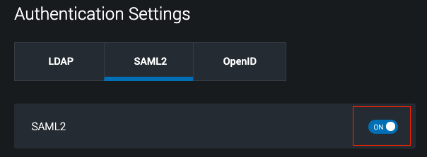
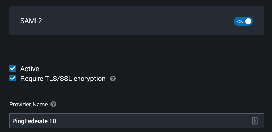
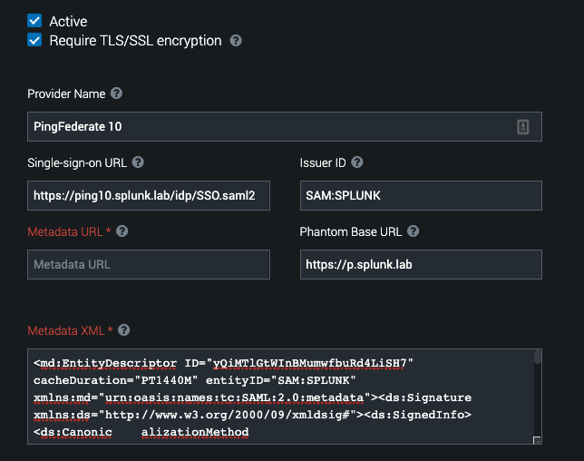
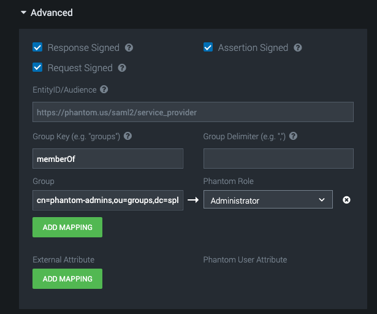
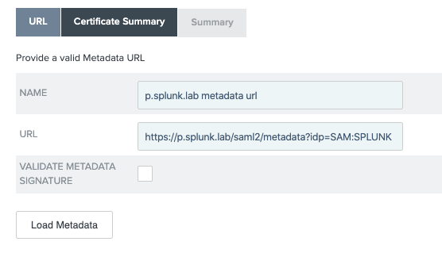

# PingFederate 10

## Configuring PingFederate

Starting Configuration:  
In this document we have some basic assuptions being made about the PingFederate environment. The configuration is intentionally not complex to better demonstrate the key elements for successful configuration.

*Data Store*: You have your PingFederate configured to a data store. In this environment, that data store is an Active Directory environment. For the sake of completeness, a screenshot is provided here but your configuration will almost certainly differ.

---

*Password Credential Validator (PCV)*: You have your PingFederate configured with a PCV against your DataStore. In our lab environment, we have a PCV connected to the Active Directory datastore (above). Again, a screenshot below for completeness but your configure will be different.

---

*Protocol Settings*: In this environment, I have SAML 2.0 enabled in the Protocol Settings.  

Other keep configuration items:  

Base URL = `https://ping10.splunk.lab:9031`  
SAML 2.0 Entity ID = `SAM:SPLUNK` 

---

*Adapters*: I have an out-of-the-box HTML Form Adapter configured. I am not using contract mappings in this document, but the configuration adjustments for a PingFederate administrator should be trivial.

---

*Signing Certs*:  I have a certificate with serial number: `01:71:18:9A:5C:E0`. The DN is `CN=signing-cert,O=Splunk Phantom, C=US`.

---

## Configuration

## PingFederate

1. `Identity Provider -> SP Connections -> Create New`.
2. In `Connection Template` select "Do not use a template for this connection" and click `Next`.
3. In `Connection Type` select "Browser SSO Profiles (Protocol SAML 2.0)" and click `Next`.
4. In `Connection Options` select "Browser SSO" and click `Next`.
5. In `Import Metadata` leave "None" selected and click `Next`.
6. In `General Settings` we'll need to configure some information. 
    - Partner's Entity ID:  The default used by Phantom is `https://phantom.us/saml2/service_provider` and that's what we'll use here. If you choose to use something else, make a note of it because you'll have to make the change in Phantom to reflect the name you've chosen.
    - Connection Name: A friendly name for this connection within PingFederate. I will use "Phantom 48"
    - Virtual Server IDS:  I am leaving this blank. Your infrastructure may require it - the SSO team would know.
    - Base URL: This is the base URL for your *Phantom* instance. In my case it is `https://p.splunk.lab` and I will use that.  
      
    ... The rest cna be filled out at your discretion.  My configuration looks like this:
     
    
     
    Click `Next`.

7. In `Browser SSO` click `Configure Browser SSO` button.
8. Select "SP-Initiated SSO" and click `Next`.
9. In `Assertion Lifetime` configure a time that is consistent with your company policy. I will leave the default of 5-minutes for both. Then click `Next`.
10. In `Assertion Creation` click `Configure Assertion Creation` button.
11. In `Identity Mapping` leave `Standard` selected and click `Next`.
12. In `Attribute Contract` you will want to add `upn` and `memberOf`. These will be used to authenticate the user (upn) and map them to roles (memberOf). These can be changed in the Phantom configuration but you can worry about that once core functionality is achieved.  Click `Next` when ready.
    
13. In `Authentication Source Mapping` I will be mapping an Adapter directly. Again, your SSO configuration may require mapping a Policy but that is more complex than necessary to demonstrate the core config.  So, click `Map New Adapter Instance`.
14. Select your adapter from the `Adapter Instance` drop-down. It will show the adapter contract. The default includes `userPrincipalName` (upn) and `memberOf` - the attributes we want to send to Phantom.  Click `Next`.
15. In `Mapping Method`, since our adapter already includes these attributes, we will leave "Use Only The Adapter Contract Values In the SAML Assertion". Were you to have a different adapter or configuration, you could connect to a data store to fulfill the contract. Click `Next`.
16. In the `Attribute Contract Fulfillment` screen, you will see three attributes:
    - SAML_SUBJECT
    - memberOf
    - upn
    You can fulfill these with the attributes of the adapter as demonstrated by the screenshot below.  Note that the AuthNRequest actually specifies the SAML_SUBJECT be transient and so the UPN will not be delivered in that attribute by PingFederate. When done, click `Next`. 
    
17. In `Issuance Criteria` click `Next`.
18. In `Summary` click `Done`.
19. In `Authentication Source Mapping` click `Next`.
20. In `Summary` click `Done`.
21. In `Assertion Creation` click `Next`.
22. In `Protocol Settings` click `Configure Protocol Settings`.
23. In `Assertion Consume Service URL` add a POST binding to the endpoint `	/saml2/callback/login` and click `Next`.
   
24. In `Allowable SAML Bindings` uncheck "Artifact" and "SOAP" leaving only "POST" and "REDIRECT" selected. Click `Next`.
25. In `Signature Policy` we want to be a secure as possible. To that end we'll want:
    - Require Authn Requests to be signed when received via the post or redirect bindings
    - Always sign assertion  
    - Sign Response as Required 
     
    to be checked. If we check the first box now, we'll need to snag the Phantom signing cert from `/opt/phantom/keystore/public_sig_saml2.pem` - but there is an easier way, which is what we're going to do. So, for now, only check "Always Sign Assertion" and "Sign Response as Require", then `Next`.
    
26. In `Encryption Policy` leave "None" selected and click `Next`.
27. In `Summary` click `Done`.
28. In `Protocol Settings` click `Next`.
29. In `Summary` click `Next`.
30. In `Browser SSO` click `Next`.
31. In `Credentials` click `Configure Credentials`.
32. In `SDigital Signature Settings` select your signing cert from the "Signing Certificate" drop-down menu, then click `Next`.
33. In `Summary` click `Done`.
34. In `Credentials` click `Next`.
35. In the `Activation and Summary` screen, make sure the Activation slider is enabled, scroll to the bottom, and click `Save`.
36. In the `SP Connections` screen, click `Save`.
37. Let's export our Metadata for that connection in PingFederate. To do this, from `Identity Provider -> SP Connections` click "Manage All"
    
38. Find the connection you've built, click the `Select Action` and then `Export Metadata`.
    
39. This will take you to the `Metadata Signing` tab. Select your Signing Certificate from the `Signing Certificate` drop-down, then click `Next`.
40. On the `Export & Summar` screen, click `Export`, then `Done`.  

Now we have a working configuration (though will will fix the required authnrequest signing in a moment). Let's switch over to Phantom to continue the configuration there...

### Phantom

Let's first configure Phantom for SSO.

First we go to `Administrative Settings -> User Management -> Authentication` and turn `ON` the SAML2 slider.

Next, let's configure a Provider Name.  Is this a key configuration item that you _must get right_? No its not. It's what will appear at the login screen. We'll call ours PingFederate 10 and see the effect.

Provider Setting Result:  

*Single-sign-on URL*: Ths setting is where the `AuthNRequest` should be sent in your SSO environment. The structure in PingFederate is `https://<url>:<port>/idp/SSO.saml2` and consequently we've configured ours as `https://ping10.splunk.lab/idp/SSO.saml2`.

*Issuer ID*: This is the Entity ID configured in PingFederate. As I mentioned above, mine is configured as `SAM:SPLUNK` and that's what we'll put in here.

*Metadata URL*: UNIMPLEMENTED. You definitely can use the metadata URL to populate configuration, but you will also have to configure Phantom to trust the cert if it's from a private/internal CA or self-signed, which I have no done. Instead, we'll use the `Metadata XML` configuration box below.

*Phantom Base URL*: The is the base-url of your phantom instance where users will be redirected back after authentication. In my lab, the Phantom instance is called `https://p.splunk.lab` and we'll put that in here.

*Metadata XML*: From the last step we completed on the PingFederate side, copy-and paste the contents of the metadata XML into the textbox.

---

Now click `Advanced Settings`.  Here you can map groups->roles and other external attributes to populate user details (e.g. givenName -> first_name, sn -> last_name). As well as control some security preferences of the SAML protocol.

On the protocol side, let's leave the following checked:
   - Response Signed
   - Request Signed
   - Assertion Signed
   
This will ensure that during the SAML authentication flow, each party is requiring verification from each other.

In the `EntityID/Audience`, if you changed the "Partner's Entity ID" in PingFederate from the default (`https://phantom.us/saml2/servce_provider`), you'll need to put that here. I did not change it.

In the `Group Key (e.g. "groups")` field, I will put `memberOf` since that is what PingFederate is sending over for group membership. I can leave the `Group Delimiter` blank because PingFederate sends each group as it's own unique item.

In `Group`, click `Add Mapping` and set the distinguishedName of the group you want to map to a role in Phantom. For this example, my Active Directory has a group with a distinguished name: `cn=phantom-admins,ou=groups,dc=splunk,dc=lab`. I will map that to the `Administrator` role.

Now we can click `Save Settings` and test to ensure SSO is working.

Once you've tested the configuration and everything is working, snag the "metadata URL" from the textbox in the middle of the SAML Configuration page. It will be in the format of: `https://<phantom>/saml2/metadata/?idp=<entityid>`. You can find it here:

Let's head back to PingFederate one last time for final config.

---

Log back into PingFederate and navigate to the Phantom connection you made previously. Within the connection navigate to `Metadata URL` and click `Enable Automation Reloading`. This will make a few more options show up. The key one is a "Metadata URL" drop-down. That may or may not have anything in it. We'll want to click `Manage Partner Metadata URLs`.

Now click  `Add New URL`.
  
In the `URL` tab, provide a name and give the URL you took from Phantom. Then click `Load Metadata` (nothing visible will happen). Uncheck "Validate Metadata Signature" as the Metadata is unsigned. Then click `Done`.

In the `Partner Metadata URLs` section, click `Save`. 

Back in `Metadata URL`, select the Metadata URL from the dropdown, and click `Load Metadata`. This is a quick way to snag the signing certificate the SP uses in signing the AuthNRequests. Now we can get that configured.

Click `Browser SSO -> Configure Browser SSO -> Protocol Settings -> Signature Policy`. Now check the "Require Authn Requests To Be Signed When Received Via the Post or Redirect Bindings". Click `Done`.

In `Protocol Settings` click `Done`.

In `Browser SSO` click `Next`.

In `Credentials`, click `Configure Credentials` as a new option is now available to select the certificate of the SP. When you click it, you will be dropped into the `Signature Verification Settings` tab. Click `Manage Signature Verification Settings`.

In the `Trust Model` screen, leave the radio-button as `Unanchored` and click `Next`.

In the `Signature Verification Certificate`, click the Certificate Drop-Down and select the Phantom cert. Then click `Add`. Then click `Next`.  

In the `Summary` screen, click `Save`.

Now the entire SSO flow should be secure.