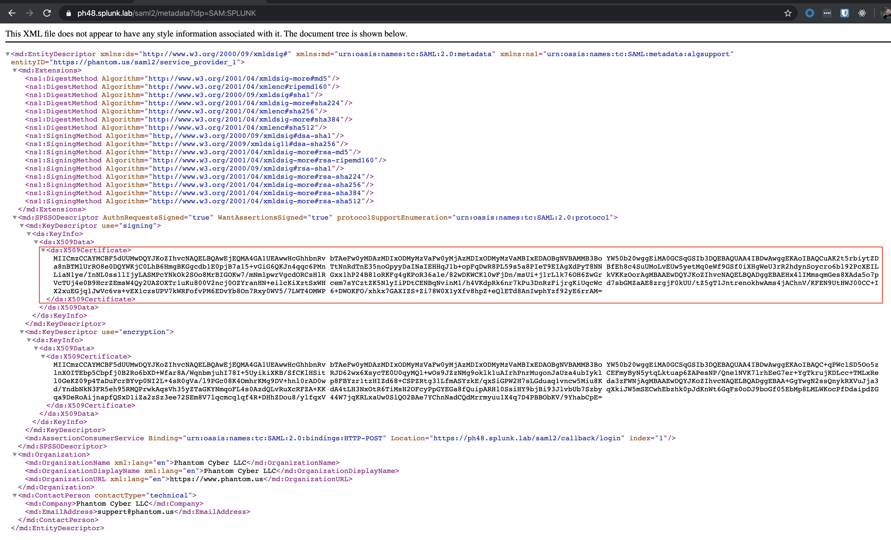
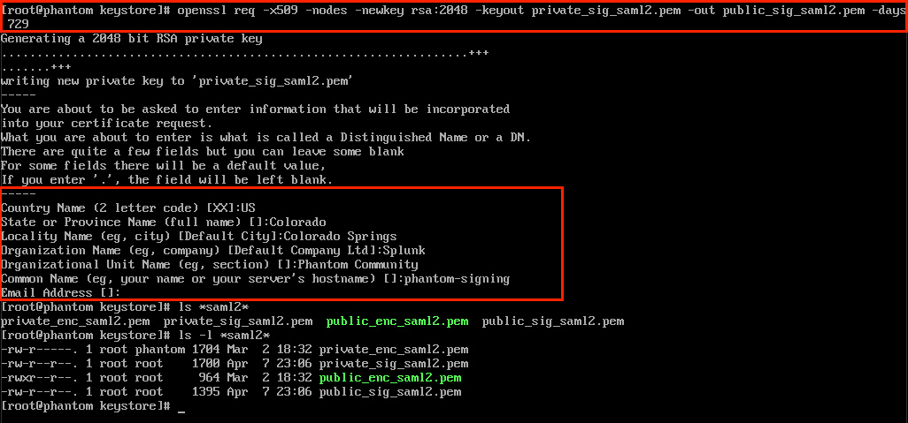
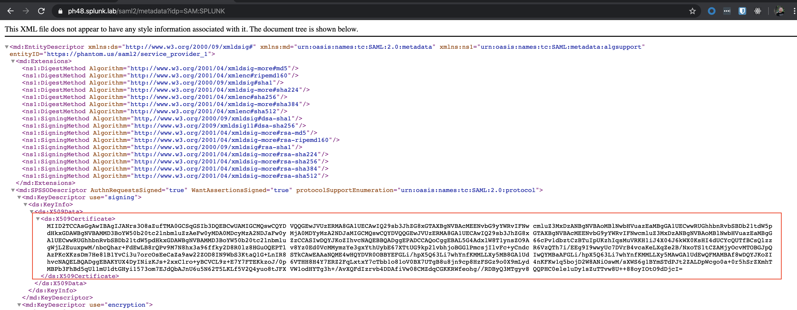

# How to Rotate the Signing and/or Encryption Certs in Phantom for SAML

Let's say you've realized your signing-cert is going to expire for your SAML infrastructure ([How do I know when my certificate is going to expire?](CheckCertExpiry.md)), and you want to rotate it. How do you do it?

A good way to start is hit the metadata endpoint in Phantom to look at the _current_ metadata. By default this endpoint is:  

`https://<phantom_url>/saml2/metadata?idp=<Issuer ID>`

This URL for your environment can be found under `Administration -> User Management -> Authentication -> SAML2` and in the center documentation block.

When you look at the Metadata URL you'll see something like the following screenshot.

*Note: That this process is applicable for both Signing and Encryption certs.

These Certificates are stored in Phantom in `/opt/phantom/keystore`. We can look at the cert properties and files by viewing the files there. We can also inspect the certificate properties with the command: `openssl x509 -noout -subject -serial -in public_sig_saml2.pem`. See screenshot.

The steps to generate a new cert are:
1. Backup your cert! Consider making a `backup` directory and copying all your SAML certs there.
2. Generate new certs. One way to handle this is using openssl on the system. In the screenshot below I used the command: `openssl req -x509 -nodes -newkey rsa:2048 -keyout private_sig_saml2.pem -out public_sig_saml2.pem -days 729`. Of course you can adjust your parameters to suit your environment.

Now you could see a new key has been generated by looking at the Metadata endpoint again.

And you can inspect the new certficate with the same openSSL command you'd issued earlier: `openssl req -x509 -nodes -newkey rsa:2048 -keyout private_sig_saml2.pem -out public_sig_saml2.pem -days 729`. See screenshot below:

---
## Important Last Step

The *important* last phase is to make sure your IDP gets the new metadata and consumes the new certificate. You can snag the metadata XML from the metadata endpoint in Phantom.
